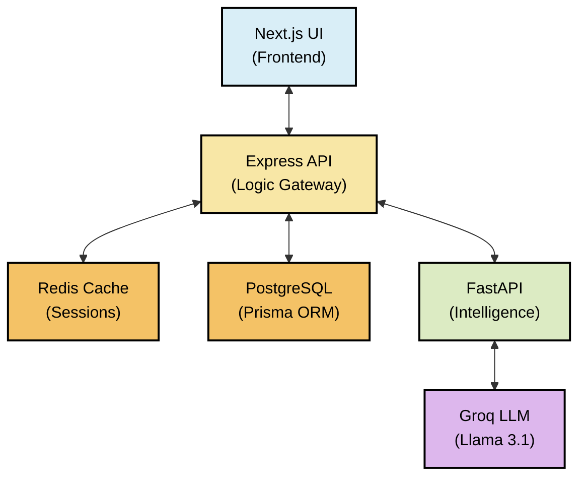
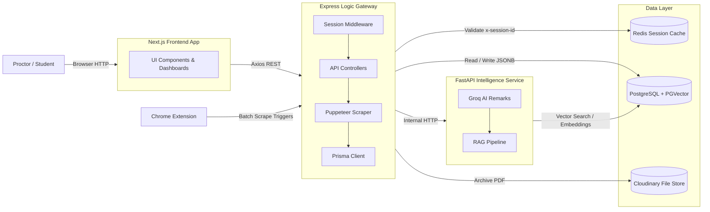

# 🎓 MSR Insight

An industry-grade, AI-powered academic reporting platform designed to transform raw student data into professional, insight-driven performance reports. Featuring a multi-tier architecture, RAG-powered chatbot, browser extension for batch scraping, secure session management, and generative AI feedback loops.


## ✨ Key Features

- **AI-Powered Insights**: Real-time performance analysis using Groq (Llama 3.1) and AI-generated academic remarks.
- **RAG Chatbot**: Retrieval-Augmented Generation chatbot powered by LangChain, PGVector (Postgres), and Google Gemini, enabling proctors to query student data conversationally.
- **Interactive Dashboards**: Specialized views for Students (personal progress tracking) and Proctors (administrative management with attendance alerts).
- **Professional A4 Reports**: Pixel-perfect reporting engine with Tiptap rich-text editing and high-fidelity PDF export.
- **Automated Email Delivery**: PDF reports generated via Puppeteer, archived on Cloudinary, and delivered to parents via Resend.
- **Browser Extension**: Chrome extension for one-click batch scraping of all proctee data with real-time progress tracking.
- **Enterprise-Grade Security**: Redis-backed stateless session management with 30-day sliding TTL and case-insensitive identity mapping.
- **Rate-Limited Scraping**: 5-minute cooldown per student to prevent portal overload, with client-side countdown timer.
- **High-Performance Architecture**: Tiered system separation (UI, Business Logic, and Data Processing) for maximum scalability.


## ✨ Architecture Overview

The system operates on a **distributed monolith** architecture with four independently runnable components:

1. **Frontend (Next.js)**: Modern, responsive UI built with Next.js 16 App Router, TypeScript, and Tailwind CSS v4.
2. **Logic Gateway (Express)**: Orchestrates business logic, manages PostgreSQL through Prisma ORM, handles session caching in Redis, and runs Puppeteer-based scraping.
3. **Intelligence Service (FastAPI)**: A high-performance Python service dedicated to AI remark generation (Groq), RAG-powered chatbot (Gemini + LangChain + PGVector), and data normalization.
4. **Browser Extension (Chrome)**: Manifest V3 extension that detects proctor sessions and orchestrates batch scraping of assigned students.

## ✨ Component Interaction


## ✨ Architecture Design



## ✨ Tech Stack


<div align="center">

<table>
  <tr>
    <th width="45%">Layer</th>
    <th width="45%">Technology</th>
    <th width="35%">Version / Details</th>
  </tr>

  <tr>
    <td><b>Frontend Framework</b></td>
    <td>Next.js (App Router)</td>
    <td>16.x</td>
  </tr>

  <tr>
    <td><b>Frontend Language</b></td>
    <td>TypeScript</td>
    <td>5.x</td>
  </tr>

  <tr>
    <td><b>CSS</b></td>
    <td>Tailwind CSS v4 + Custom CSS</td>
    <td>4.x</td>
  </tr>

  <tr>
    <td><b>Charts</b></td>
    <td>Recharts</td>
    <td>3.x</td>
  </tr>

  <tr>
    <td><b>Rich Text Editor</b></td>
    <td>Tiptap</td>
    <td>2.x</td>
  </tr>

  <tr>
    <td><b>PDF (Client-side)</b></td>
    <td>html2pdf.js</td>
    <td>0.10.x</td>
  </tr>

  <tr>
    <td><b>HTTP Client</b></td>
    <td>Axios</td>
    <td>1.x</td>
  </tr>

  <tr>
    <td><b>Icons</b></td>
    <td>Lucide React</td>
    <td>0.479.x</td>
  </tr>

  <tr>
    <td><b>Animations</b></td>
    <td>Framer Motion</td>
    <td>12.x</td>
  </tr>

  <tr>
    <td><b>API Gateway</b></td>
    <td>Express</td>
    <td>4.18.x</td>
  </tr>

  <tr>
    <td><b>ORM</b></td>
    <td>Prisma</td>
    <td>7.4.x</td>
  </tr>

  <tr>
    <td><b>Database</b></td>
    <td>PostgreSQL (Neon Serverless)</td>
    <td>—</td>
  </tr>

  <tr>
    <td><b>Session Cache</b></td>
    <td>Redis (Upstash, TLS)</td>
    <td>redis@4.x</td>
  </tr>

  <tr>
    <td><b>Password Hashing</b></td>
    <td>bcrypt</td>
    <td>6.x</td>
  </tr>

  <tr>
    <td><b>Server-side PDF</b></td>
    <td>Puppeteer</td>
    <td>22.x</td>
  </tr>

  <tr>
    <td><b>HTML Parsing</b></td>
    <td>Cheerio</td>
    <td>1.x</td>
  </tr>

  <tr>
    <td><b>Email Delivery</b></td>
    <td>Resend</td>
    <td>3.x</td>
  </tr>

  <tr>
    <td><b>PDF Storage</b></td>
    <td>Cloudinary</td>
    <td>1.x</td>
  </tr>

  <tr>
    <td><b>Python API</b></td>
    <td>FastAPI + Uvicorn</td>
    <td>Latest</td>
  </tr>

  <tr>
    <td><b>LLM (Remarks)</b></td>
    <td>Groq SDK (Llama 3.1 8B Instant)</td>
    <td>Latest</td>
  </tr>

  <tr>
    <td><b>LLM (RAG Chat)</b></td>
    <td>Google Gemini (3.1 Flash Lite)</td>
    <td>Latest</td>
  </tr>

  <tr>
    <td><b>Embeddings</b></td>
    <td>Gemini Embedding 001</td>
    <td>Latest</td>
  </tr>

  <tr>
    <td><b>Vector Store</b></td>
    <td>PGVector (Postgres)</td>
    <td>Latest</td>
  </tr>

  <tr>
    <td><b>RAG Framework</b></td>
    <td>LangChain Core + Community</td>
    <td>Latest</td>
  </tr>

  <tr>
    <td><b>Config (Python)</b></td>
    <td>pydantic-settings</td>
    <td>Latest</td>
  </tr>

  <tr>
    <td><b>Browser Extension</b></td>
    <td>Chrome Manifest V3</td>
    <td>—</td>
  </tr>

  <tr>
    <td><b>Package Manager</b></td>
    <td>npm (Node), pip (Python)</td>
    <td>—</td>
  </tr>

  <tr>
    <td><b>Dev Runner</b></td>
    <td>nodemon, uvicorn --reload</td>
    <td>—</td>
  </tr>

</table>

</div>
<p align="center">
  
  
  
  
  
  
  
  
  
  
  
</p>

## Getting Started

### Prerequisites

- Node.js (v18+)
- Python (v3.10+)
- PostgreSQL Database
- Redis Instance
- Google Gemini API Key (for RAG chatbot)
- Groq API Key (for AI remarks)

### 1. Intelligence Service (FastAPI)
```bash
cd backend/fastapi
python -m venv venv
source venv/bin/activate  # macOS/Linux
# .\venv\Scripts\activate # Windows
pip install -r requirements.txt
# Create .env with GROQ_API_KEY, GEMINI_API_KEY, DATABASE_URL
uvicorn main:app --reload --port 8000
```

### 2. Logic Gateway (Express)
```bash
cd backend/express
npm install
# Setup .env with DATABASE_URL, REDIS_URL, FASTAPI_URL, and PORT=5001
npx prisma generate
node prisma/seed.js # To populate initial proctor data
npm run dev
```

### 3. Frontend (Next.js)
```bash
cd frontend
npm install
# Create .env with NEXT_PUBLIC_API_URL and NEXT_PUBLIC_FASTAPI_URL
npm run dev
```

### 4. Browser Extension (Optional)
1. Open `chrome://extensions/` in Chrome
2. Enable Developer Mode
3. Click "Load unpacked" and select the `_extension/` folder
4. The extension auto-detects proctor login sessions on `localhost:3000`

### Quick Launch (Windows)
```bash
start-all.bat
```

---

## Project Structure

```text
MSR-Insight/
├── _extension/                     # Chrome Extension (Manifest V3)
│   ├── manifest.json               # Extension config
│   ├── background.js               # Batch scrape orchestrator
│   ├── content.js                  # Session detection from localStorage
│   ├── popup.html                  # Extension popup UI
│   └── popup.js                    # Popup logic + state display
├── backend/
│   ├── express/                    # Node.js API Gateway
│   │   ├── prisma/
│   │   │   ├── schema.prisma       # DB schema (Student, Proctor, Parent, ProctorStudentMap)
│   │   │   ├── seed.js             # Initial data seeder
│   │   │   └── migrations/         # Prisma migration history
│   │   └── src/
│   │       ├── app.js              # Express app wiring (routes, CORS, error handler)
│   │       ├── config/
│   │       │   ├── db.config.js    # Prisma client setup
│   │       │   └── redis.config.js  # Upstash Redis client (TLS)
│   │       ├── controllers/
│   │       │   ├── auth.controller.js      # Student & proctor auth
│   │       │   ├── admin.controller.js     # Proctor CRUD + student assignment
│   │       │   ├── proctor.controller.js   # Dashboard, chat, notifications, scrape-list
│   │       │   └── report.controller.js    # Dashboard data, AI remarks, email dispatch
│   │       ├── middlewares/
│   │       │   ├── session.middleware.js   # Redis session validation + sliding TTL
│   │       │   ├── auth.middleware.js       # Re-exports session middleware
│   │       │   └── error.middleware.js      # Global error handler
│   │       ├── repositories/
│   │       │   ├── user.repository.js       # Prisma queries for Student model
│   │       │   └── proctor.repository.js   # Prisma queries for Proctor + mappings
│   │       ├── routes/
│   │       │   ├── auth.routes.js           # /api/auth/*
│   │       │   ├── admin.routes.js         # /api/admin/*
│   │       │   ├── proctor.routes.js        # /api/proctor/*
│   │       │   ├── report.routes.js         # /api/report/*
│   │       │   ├── notification.routes.js   # /api/notifications/*
│   │       │   ├── student.routes.js        # /api/students/sync
│   │       │   └── students.js              # Legacy sync route
│   │       ├── services/
│   │       │   ├── auth.service.js          # Login, register, session lifecycle
│   │       │   ├── report.service.js        # FastAPI proxy (remarks + RAG sync trigger)
│   │       │   ├── studentService.js        # Dashboard reads + JSONB sync
│   │       │   ├── puppeteerScraper.service.js  # Puppeteer scraper + data normalizer
│   │       │   └── email.service.js         # Puppeteer PDF + Resend + Cloudinary
│   │       └── utils/
│   │           └── dateUtils.js             # DOB format normalization
│   └── fastapi/                    # Python Intelligence Service
│       ├── main.py                 # FastAPI entry point + router wiring
│       ├── config/
│       │   └── settings.py         # Pydantic settings from .env
│       ├── models/
│       │   └── request_models.py   # Pydantic request schemas
│       ├── routers/
│       │   ├── report_router.py    # /generate-remark endpoint
│       │   └── rag_router.py       # /api/rag/* (sync, chat, status)
│       ├── services/
│       │   ├── ai_service.py       # Validates input + calls Groq LLM
│       │   ├── prompt_builder.py   # Builds structured prompt for remark generation
│       │   ├── llm_provider.py     # Groq SDK wrapper
│       │   └── rag_service.py     # Full RAG pipeline (PGVector + Gemini + LangChain)
│       └── data/
│           └── *.json              # Legacy data files
├── frontend/                       # Next.js 16 App Router SPA
│   └── src/
│       ├── app/
│       │   ├── layout.tsx          # Root layout with AppWrapper
│       │   ├── page.tsx            # Landing page
│       │   ├── (auth)/             # Auth route group
│       │   │   ├── student-login/  # USN + DOB login
│       │   │   └── proctor-login/  # Proctor ID + password login
│       │   ├── (dashboard)/        # Dashboard route group
│       │   │   ├── student/dashboard/   # Student dashboard + sections
│       │   │   └── proctor/[proctorId]/  # Proctor dashboard + proctee details
│       │   ├── admin/page.tsx      # Admin CRUD panel
│       │   └── report/[usn]/      # A4 report with Tiptap editor
│       ├── components/
│       │   ├── AppWrapper.tsx      # Global layout: Navbar + Inbox + session logic
│       │   ├── dashboard/
│       │   │   ├── DOBSelector.tsx  # Date of birth input
│       │   │   ├── Editor.tsx       # Tiptap rich text editor wrapper
│       │   │   ├── InboxPanel.tsx  # Attendance alert inbox
│       │   │   ├── ProctorChatbot.tsx  # RAG chatbot interface
│       │   │   ├── ReportComponent.tsx  # A4 report renderer + PDF export
│       │   │   ├── UpdateButton.tsx    # Scrape trigger with cooldown
│       │   │   ├── LoadingScreen.tsx
│       │   │   ├── ProgressToast.tsx
│       │   │   ├── DashboardHeader.tsx
│       │   │   ├── SidebarProfile.tsx
│       │   │   └── sections/        # Student dashboard sections
│       │   │       ├── AnalyticsSection.tsx    # CGPA & exam charts
│       │   │       ├── HistorySection.tsx      # Semester history
│       │   │       ├── PerformanceSection.tsx  # Subject marks breakdown
│       │   │       └── SimulatorSection.tsx    # Grade prediction simulator
│       │   ├── navbar/             # Navigation bar + academic year picker
│       │   └── ui/                 # Shared UI components
│       ├── config/
│       │   └── api.config.ts       # API base URLs
│       ├── hooks/
│       │   └── useCooldown.ts      # 5-minute scrape cooldown hook
│       ├── lib/
│       │   └── AppContext.tsx       # Global state: academicYear, alerts, inbox
│       └── styles/                 # CSS modules + globals
└── start-all.bat                  # Quick-launch script for Windows
```

---

## Data Layer

### PostgreSQL Schema (via Prisma)

```
students
  usn           String  @id          -- e.g. "1MS24IS400" (always uppercase)
  name          String
  dob           String?              -- DD-MM-YYYY format
  phone         String?
  email         String?
  current_year  Int
  details       Json                 -- JSONB: normalized scraped academic data
  parents       Parent[]
  proctor_maps  ProctorStudentMap[]

parents
  usn           String               -- FK -> students.usn
  relation      String               -- "Father" / "Mother"
  name          String
  phone         String
  email         String
  @@id([usn, relation])

proctors
  proctor_id    String  @id          -- always uppercase
  name          String?
  phone         String?
  email         String?
  password_hash String
  student_maps  ProctorStudentMap[]

proctor_student_map
  id            Int     @id @autoincrement
  proctor_id    String  FK -> proctors
  student_id    String  FK -> students.usn
  academic_year String               -- e.g. "2027"
  @@unique([student_id, academic_year])   -- one proctor per student per year
```

### `details` JSONB Schema

```json
{
  "usn": "1MS24IS400",
  "name": "Student Name",
  "class_details": "SEM 4 SEC A ...",
  "cgpa": "8.5",
  "last_updated": "2025-04-01 10:00:00",
  "subjects": [
    {
      "code": "22IS45",
      "name": "Operating Systems",
      "marks": 42.5,
      "attendance": 78.0,
      "attendance_details": {
        "present": 45, "absent": 12, "remaining": 5, "percentage": 78
      },
      "assessments": [
        {"type": "T1", "obtained_marks": 22.0, "class_average": 18.5},
        {"type": "AQ1", "obtained_marks": 9.0, "class_average": 8.0}
      ]
    }
  ],
  "exam_history": [
    {
      "semester": "Semester 1 2023-24",
      "sgpa": "8.40",
      "credits_earned": "22",
      "courses": [{"code": "22MAT11", "name": "Mathematics", "gpa": "9", "grade": "A+"}]
    }
  ]
}
```

### Redis Key Schema

| Key | Value | TTL |
|---|---|---|
| `session:<uuid>` | `student:<USN>` or `proctor:<ID>` | 30 days |
| `usn:<USN>` | `<sessionId>` | 30 days |
| `proctor:<ID>` | `<sessionId>` | 30 days |

### Storage Systems

- **PostgreSQL (Neon)**: Primary persistent store. All structured + unstructured (JSONB) data.
- **Redis (Upstash)**: Session cache only. TLS-secured (`rediss://`).
- **PGVector (PostgreSQL)**: Vector store for RAG chatbot. Embedded tables are hosted directly in the Neon PostgreSQL database instance (`student_data_v2`).
- **Cloudinary**: PDF archival storage for emailed reports.

---

## API Reference

### Express API (`http://localhost:5001`)

| Method | Route | Auth | Description |
|---|---|---|---|
| GET | `/api/health` | None | Health check |
| POST | `/api/auth/register` | None | Register student (USN + DOB) |
| POST | `/api/auth/login` | None | Student login -> sessionId |
| POST | `/api/auth/proctor-register` | None | Register proctor |
| POST | `/api/auth/proctor-login` | None | Proctor login -> sessionId |
| POST | `/api/auth/logout` | `x-session-id` | Invalidate session |
| GET | `/api/auth/profile` | `x-session-id` | Get session identity |
| GET | `/api/report/student/:usn` | Session | Student dashboard data |
| GET | `/api/report/:usn` | Session | Generate AI remark (Groq) |
| POST | `/api/report/update` | Session | Trigger re-scrape (5-min cooldown) |
| POST | `/api/report/send-email` | Session | Send PDF report to parents |
| GET | `/api/proctor/:id/dashboard` | Session | Proctor's proctee list |
| GET | `/api/proctor/:id/student/:usn` | Session | Single proctee detail |
| GET | `/api/proctor/:id/scrape-list` | Session | List of proctee USNs + DOBs |
| GET | `/api/proctor/:id/notifications` | Session | Attendance alert list |
| POST | `/api/proctor/:id/chat` | Session | Proctor chatbot (Ollama) |
| GET | `/api/notifications/:id` | Session | Attendance alerts (alt path) |
| POST | `/api/students/sync` | None | Receive normalized data from scraper |
| GET | `/api/admin/proctors` | None | List all proctors |
| POST | `/api/admin/proctors` | None | Add/update proctor |
| DELETE | `/api/admin/proctors/:id` | None | Remove proctor + assignments |
| GET | `/api/admin/proctors/:id/students` | None | List proctor's students |
| POST | `/api/admin/proctors/:id/students` | None | Assign student to proctor |
| DELETE | `/api/admin/proctors/:id/students/:usn` | None | Remove student assignment |
| GET | `/api/admin/students/unassigned` | None | Unassigned students |
| GET | `/api/admin/stats` | None | System counts |

**Auth mechanism**: Custom header `x-session-id: <uuid>` validated against Redis. No JWT.

### FastAPI (`http://localhost:8000`)

| Method | Route | Description |
|---|---|---|
| GET | `/api/health` | Health check |
| GET | `/` | Root ping |
| POST | `/generate-remark` | Generate AI remark from student data (Groq) |
| POST | `/api/rag/sync` | Trigger RAG data sync (background) |
| GET | `/api/rag/sync/status` | Check RAG sync status |
| POST | `/api/rag/chat` | RAG chatbot query (Gemini + PGVector) |

### Frontend Routes (Next.js App Router)

| Path | Description |
|---|---|
| `/` | Landing page |
| `/student-login` | USN + DOB login form |
| `/student/dashboard` | Student dashboard with sections |
| `/report/:usn` | A4 report with Tiptap editor + PDF export |
| `/proctor-login` | Proctor ID + password login |
| `/proctor/:id/dashboard` | Proctor dashboard with proctee cards |
| `/proctor/:id/student/:usn` | Individual proctee detail view |
| `/admin` | Admin CRUD panel |

---

## Key Data Flows

### Student Login -> Dashboard
1. Student submits USN + DOB on `/student-login`
2. `POST /api/auth/login` -> Prisma validates credentials -> Redis creates session
3. Frontend navigates to `/student/dashboard` with `x-session-id` header
4. `GET /api/report/student/:usn` -> checks PostgreSQL JSONB
5. If empty: triggers Puppeteer scraper -> normalizes data -> upserts into PostgreSQL
6. Dashboard renders subjects, attendance, CGPA, exam history via interactive sections

### AI Remark Generation
1. User clicks "Generate AI Report" on dashboard
2. `GET /api/report/:usn` -> extracts subjects from JSONB -> `POST /generate-remark` to FastAPI
3. Groq `llama-3.1-8b-instant` generates a 2-line academic performance summary
4. Remark is displayed and can be edited in the Tiptap rich text editor

### Proctor RAG Chatbot
1. Proctor login triggers `notifyRagSync()` -> `POST /api/rag/sync` to FastAPI
2. RAG service fetches all student records from PostgreSQL -> chunks into semantic categories
3. Chunks embedded with Gemini embeddings -> stored in PGVector (Postgres) with metadata filters
4. On chat query: query rewriting -> intent detection -> ensemble retrieval (BM25 + semantic)
5. Retrieved context + question sent to Gemini for grounded response generation

### Email Report Delivery
1. Frontend sends HTML content to `POST /api/report/send-email`
2. Puppeteer renders HTML to A4 PDF with 2x scale
3. PDF uploaded to Cloudinary for archival
4. Resend API delivers email with PDF attachment to each parent

### Browser Extension Batch Scrape
1. Content script detects proctor session in localStorage
2. Background service fetches proctee list from `/api/proctor/:id/scrape-list`
3. Sequentially triggers `POST /api/report/update` for each student
4. Popup displays real-time progress with success/failure counts

---

## Security & Sessions

The project implements a **Stateless-Session Hybrid**:
- Authentication results are cached in **Redis** with a 30-day TTL.
- Middleware ensures protected routes are guarded via `x-session-id` headers.
- Session TTL is refreshed on every authenticated request (sliding window).
- Proctor sessions are reused if already active (no duplicate sessions).
- Persistent login data stored in LocalStorage for seamless UX.

---

## Environment Configuration

### Express (`backend/express/.env`)

| Variable | Purpose |
|---|---|
| `PORT` | Express server port (5001) |
| `DATABASE_URL` | Neon PostgreSQL connection string |
| `REDIS_URL` | Upstash Redis connection string (TLS) |
| `FASTAPI_URL` | FastAPI service base URL |
| `RESEND_API_KEY` | Resend email API key |
| `RESEND_FROM_EMAIL` | Sender email address |
| `CLOUDINARY_CLOUD_NAME` | Cloudinary cloud name |
| `CLOUDINARY_API_KEY` | Cloudinary API key |
| `CLOUDINARY_API_SECRET` | Cloudinary API secret |
| `GEMINI_API_KEY` | Google Gemini API key |
| `OLLAMA_API_URL` | Ollama API endpoint |

### FastAPI (`backend/fastapi/.env`)

| Variable | Purpose |
|---|---|
| `GROQ_API_KEY` | Groq LLM API key |
| `GROQ_MODEL` | Groq model name |
| `GEMINI_API_KEY` | Google Gemini API key (for RAG) |
| `DATABASE_URL` | PostgreSQL connection string |
| `OLLAMA_API_URL` | Ollama API endpoint |
| `OLLAMA_MODEL` | Ollama model name |

### Frontend (`frontend/.env`)

| Variable | Purpose |
|---|---|
| `NEXT_PUBLIC_API_URL` | Express API base URL |
| `NEXT_PUBLIC_FASTAPI_URL` | FastAPI base URL |

---

## Known Issues & Considerations

1. **Admin routes have no authentication** -- All `/api/admin/*` routes are unprotected. Anyone can create/delete proctors.
2. **`/api/auth/proctor-register` is public** -- Any user can register a new proctor without admin authorization.
3. **`students.js` legacy route** -- `backend/express/src/routes/students.js` appears to be a duplicate of `student.routes.js`.
4. **`mongoose` in Express dependencies** -- Listed in `package.json` but no MongoDB usage exists. Dead dependency.
5. **`academicYear` defaults to `"2027"`** -- Hardcoded in 5+ places. Should be centralized.
6. **No automated test suite** -- Zero test files across the entire project.
7. **Dual chatbot implementations** -- Proctor chat uses Ollama (Express) and RAG (FastAPI). Consider consolidating.
8. **Browser extension `host_permissions`** -- Points to `localhost:3000` but frontend runs on port 3000 (Next.js default).

---

*Built for Academic Excellence at M S Ramaiah Institute of Technology, Bangalore.*
